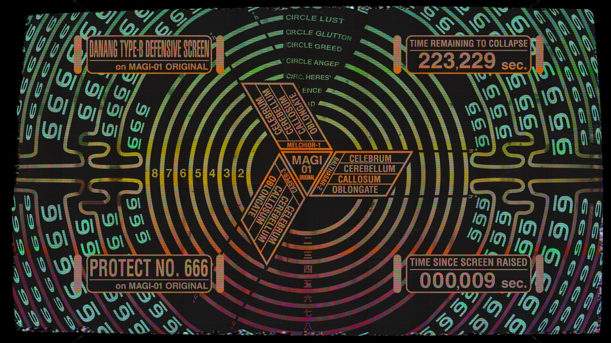

<p align="center">
  
</p>

# MAGI — Multi-Agent Action Gating

<p align="center">
  
</p>

MAGI is an independent, multi-perspective gate that rules allow/deny on
high-impact actions proposed by coding agents (and, in a future phase, CI/CD
pipelines) before they execute. Three independent evaluators — **Melchior**
(fact/consistency), **Balthasar** (blast radius to others + policy), and
**Casper** (actor risk/anomaly) — each cast one vote per proposed action; a
deterministic, table-driven severity classifier decides how much consensus
is required before an action is allowed.

This repository currently ships **v1, scope P0–P3**: deterministic gating
core, hash-chained audit log with an audited human-override record kind, a
Claude Code `PreToolUse` hook adapter supporting both **shadow** and
**enforcing** mode, and a human-grounded calibration corpus + divergence
harness. On top of that base, P4 extends the deterministic severity
classifier with a non-git threat matrix (implemented, verified, and
archived — see
[Non-git threat matrix](#non-git-threat-matrix-p4) below). See
[Scope](#scope-p0p4-this-repository) and
[Out of scope](#out-of-scope--not-implemented-here) below for the precise
boundary. For a practical, day-to-day usage guide (modes, the severity
matrix, every CLI command, evaluator backend swaps, troubleshooting), see
[MANUAL.md](MANUAL.md).

## Status: local-only, opt-in enforcing mode

This project has **no production deployment target yet**. Mode resolves
exclusively from the `MAGI_MODE` environment variable, defaulting to
`shadow` on anything unset or invalid — enforcing behavior is opt-in per
session, never a config-file default. See
[Shadow mode](#shadow-mode-always-allows-always-records) and
[Enforcing mode](#enforcing-mode-blocks-deny-verdicts--audited-human-override)
below for exactly what each mode does.

## Scope (P0–P4, this repository)

| Phase | What it delivers |
|---|---|
| P0 — domain core + audit | `ProposedAction` normalization, table-driven severity classification (`src/gating/severity.ts`), the trivial-scope read-only allowlist (`src/gating/allowlist.ts`), quorum consensus + verdict assembly (`src/gating/consensus.ts`, `src/gating/verdict.ts`), and the tamper-evident hash-chained audit sink (`src/audit/`). |
| P1 — shadow-mode hook | The Claude Code `PreToolUse` hook adapter (`claude-code-hook/index.ts`), wiring allowlist → severity → evaluators → consensus → verdict → audit into one pipeline, running in `MAGI_MODE=shadow`. |
| P2 — calibration + divergence harness | A local, human-grounded calibration corpus (`src/calibration/corpus.ts`), deterministic lexical exemplar retrieval (`src/calibration/selector.ts`), and a divergence harness (`src/calibration/divergence-harness.ts`) that proves the three evaluator facets genuinely disagree on designed-divergent fixtures and agree on controls — catching cosmetic persona collapse. |
| P3 — enforcing mode + audited human override | `MAGI_MODE=enforced` actually blocks a `deny` verdict via Claude Code's documented `hookSpecificOutput` contract, and `magi audit override <hash> --reason "<why>"` lets an operator document that a recorded deny should be disregarded without mutating the audit chain. |
| P4 — non-git threat-matrix extension | A `NON_GIT_RULES` table in the severity classifier (`src/gating/severity.ts`) covering 8 destructive command families beyond `git`, plus a dispatch fix so `sudo`/`doas`-prefixed commands no longer bypass the threat matrix. Verified (`sdd-verify`: PASS WITH WARNINGS, 0 critical) and archived — see [Non-git threat matrix](#non-git-threat-matrix-p4) below. |

Three independent evaluators back every non-trivial gated action:

- **Melchior** — fact/consistency (`src/gating/melchior.ts`)
- **Balthasar** — blast radius to others + policy (`src/gating/balthasar.ts`)
- **Casper** — actor risk/anomaly (`src/gating/casper.ts`)

Consensus/quorum rule (spec Requirement: Consensus and Quorum):
low/medium severity requires 2-of-3 `allow`; high/critical severity
requires a unanimous 3-of-3 `allow`. `abstain` never counts toward allow,
at any tier. Sync-tier evaluator timeout or transport error is treated as
`deny` (fail-closed), never `allow`.

By default, all three named evaluators are backed by
[Groq](https://groq.com)'s free-tier API (`src/gating/groq-evaluator.ts`,
`GROQ_API_KEY` — free, no card required), each on its own confirmed
free-tier model: Melchior uses `openai/gpt-oss-120b`, Balthasar uses
`llama-3.3-70b-versatile`, and Casper uses `llama-3.1-8b-instant`. Two alternative `EvaluatorPort`
backends ship and satisfy the same contract but are **not** wired into
production: `AnthropicEvaluator` (`src/gating/anthropic-evaluator.ts`,
`ANTHROPIC_API_KEY`) and `GeminiEvaluator` (`src/gating/gemini-evaluator.ts`,
`GEMINI_API_KEY`, defaults to `gemini-2.5-flash-lite`). Each `create*`
function (`createMelchior`/`createBalthasar`/`createCasper`) accepts
`GroqEvaluatorOptions` (`client`, `apiKey`, `model`, `timeoutMs`,
`maxTokens`, `baseUrl`) to override the default Groq backend's settings or
inject a test double; to swap the backend entirely (e.g. to Anthropic or
Gemini), construct `new AnthropicEvaluator(name, facet, options)` or
`new GeminiEvaluator(name, facet, options)` directly with the matching
facet from `melchior.ts`/`balthasar.ts`/`casper.ts` instead of using
`create*`, and pass the result via `RunHookOptions.evaluators` /
`MainDeps.evaluators` — see MANUAL.md, section 4, for worked examples of
both swaps.

## Shadow mode: always allows, always records

**`MAGI_MODE=shadow` never blocks a tool call, regardless of the computed
verdict.** If severity classification, all three evaluators, and consensus
resolution together compute `deny` for a critical action, the hook
adapter still allows the underlying Claude Code tool call to proceed.

What shadow mode *does* do, unconditionally, for every non-trivial gated
action: it durably appends the full verdict — decision, severity, all
three evaluator votes + rationales, actor, mode, timestamp — to the
hash-chained audit log (`.magi/audit/`) **before** the hook returns its
`allow` decision. This is what makes shadow mode useful even though it
never blocks: it measures what an enforcing gate *would have* decided,
against real day-to-day agent activity, without any risk of an
over-eager gate wedging a real workflow.

This is a deliberate two-step rollout (see `sdd/magi/design`'s P1 → P4
plan): observe and measure false-positive rate in shadow mode first,
build enough confidence in the evaluators' judgment (backed by a real
calibration corpus), and only then flip to enforcing per session via
`MAGI_MODE=enforced` — see
[Enforcing mode](#enforcing-mode-blocks-deny-verdicts--audited-human-override)
below.

Use `magi audit stats` to see the recorded verdict distribution and a
raw deny-rate proxy for the evaluation period (see
[CLI commands](#cli-commands) below).

## Enforcing mode: blocks deny verdicts + audited human override

**`MAGI_MODE=enforced` blocks a tool call when the computed verdict's
`decision` is `deny`** (mode resolves exclusively from the `MAGI_MODE`
environment variable — `magi.config.json` carries no `mode` key at all,
see spec Requirement: Single Mode Source). Any `allow` verdict, and the
trivial-scope allowlist short-circuit, behave identically to shadow mode
in both modes. Every action is still durably audited before the mode gate
runs, in either mode.

A block is communicated to Claude Code via the documented `PreToolUse`
`hookSpecificOutput` contract (`permissionDecision: "deny"`), with a
reason that includes **all three evaluators' individual votes and
rationales** (not just the aggregate decision), plus the audit record's
hash and a ready-to-copy override hint. The hook process itself always
exits `0` — the JSON `permissionDecision` is the sole authority, never
the exit code.

```bash
# Point Claude Code's PreToolUse hook at claude-code-hook/index.ts and set:
MAGI_MODE=enforced
```

### Audited human override

Blocking is not the end of the story: `magi audit override <hash>
--reason "<why>"` lets an operator document that a specific recorded
`deny` should be disregarded — **without mutating the tamper-evident
audit chain** and **without granting an allowlist entry or triggering an
automatic retry**. It appends a second, distinct record kind
(`OverrideRecordSchema`) to the same hash chain, referencing the original
record by hash:

```bash
magi audit override <hash> --reason "operator verified this force-push manually"
```

The CLI resolves the target **by content hash, not by `seq`**, requires a
non-empty `--reason`, and only accepts a target whose `decision` is
`deny` — any rejection (unknown hash, missing/empty reason, or a
non-`deny` target) writes nothing at all. The action itself is never
re-run by the override command; proceeding is a separate, deliberate
operator re-attempt. `magi audit stats` reports override count/rate as
its own metric — an override never reclassifies the original record out
of the deny count.

### Trivial-scope allowlist

Not every intercepted tool call is gated at all. A static, code-defined
allowlist (`src/gating/allowlist.ts`, scope documented in
`docs/trivial-allowlist-scope.md`) short-circuits **only** confirmed
read-only, zero-side-effect operations (file reads, `git log`/`git diff`,
grep/glob-style searches) straight to allow — no evaluator calls, no
audit record. This is what keeps the hook usable: gating every `Read`,
`Grep`, and `Glob` tool call through three model calls each would make
the adapter unusable in practice. Everything else — every mutation,
every execution, every command the allowlist can't positively confirm as
trivial — goes through the full severity/quorum pipeline with no
exception.

### Non-git threat matrix (P4)

The deterministic severity classifier (`src/gating/severity.ts`) previously
only had threat-matrix rules for the `git` executable — any other
executable (`rm`, `dd`, `docker`, a SQL CLI, etc.) always classified as
`low` severity regardless of how destructive the actual command was. A new
`NON_GIT_RULES` table now covers 8 destructive command families: `rm -rf`,
`dd` (device writes), `mkfs*`, `shred`, `chmod -R`/`chown -R` (broad
permission changes), bare-interpreter pipe-to-shell proxy detection (e.g.
`curl ... | sh`), destructive `docker` subcommands (`system prune -a
--volumes`, `rmi -f`, `volume rm`), and destructive inline DB-CLI
statements (`psql -c`/`mysql -e` containing `DROP`/`TRUNCATE`/an
unqualified `DELETE`). A related fix in the same commit: `sudo`/`doas`-
prefixed commands (e.g. `sudo rm -rf /`) previously bypassed the *entire*
threat matrix (git rules included) because the parser reported `sudo` as
the executable — dispatch now normalizes past the sudo/doas wrapper before
classification.

This work is implemented, verified, and archived (`045ce2f` on `master`,
on top of the P0–P3 base; `a874dd7` fixes a `dd`-tier gap `sdd-verify`
caught against the approved spec — a `dd` invocation that isn't a device
write now correctly escalates to `high` instead of falling through to
`low`), with the full test suite passing (395/395). `sdd-verify`'s final
verdict is PASS WITH WARNINGS: 0 critical findings, 1 non-blocking
warning (missing a literal `python3 script.py` negative test for the
bare-interpreter rule), 1 cosmetic suggestion (a scenario-count doc
mismatch in the spec) — neither blocks correctness.

## Out of scope — NOT implemented here

The following are explicitly deferred to a future change, per
`sdd/magi/tasks`' own "out of scope" boundary and the local-only rollout
decision (`sdd/magi/design-decisions`):

- **CI/CD pipeline adapter** (async mode's Requirement: CI/CD Pipeline
  Adapter). There is no production pipeline to gate yet.
- **Async mode's bounded tool loop + human escalation** (a stronger model
  with real, bounded tool access, escalating ambiguous/high-severity
  verdicts to a human with a visible-failure timeout).

Building either of the above now, against a pipeline and escalation
posture that don't exist yet, would be premature — this is a deliberate
scope boundary, not an oversight. (Enforcing mode and the audited human
override CLI, previously listed here, shipped in P3 — see
[Enforcing mode](#enforcing-mode-blocks-deny-verdicts--audited-human-override)
above.)

## Placeholder values — revisit after the first real corpus

Two numeric thresholds in `magi.config.json` and the calibration harness
are explicit **placeholders**, confirmed as acceptable to proceed with
before any real calibration corpus exists (`sdd/magi/design-decisions`):

- **Selector top-K**: `tiers.sync.k = 5` (used, once calibration
  injection is wired), `tiers.async.k = 12` (currently unused — async
  mode itself is out of scope, see above).
- **Divergence harness floor**: `tiers.divergenceFloorPercent = 40` — the
  minimum fraction of designed-divergent fixtures the three evaluator
  facets must genuinely disagree on for `magi calibrate verify` to pass.

Both values are placeholders precisely because there is no real
calibration corpus yet to validate them against — they were never
derived from real operator judgment data. **Revisit both once the first
real calibration corpus exists** (built via `magi calibrate` / `magi
calibrate import`, see below), rather than treating either number as
load-bearing today.

## Setup

```bash
npm install
npm run typecheck   # tsc --noEmit
npm test            # node --test "tests/**/*.test.ts"
npm run build        # bundles src/cli/main.ts -> dist/magi.mjs
```

Requires Node.js >= 22 (developed and verified against Node v26's native
TypeScript strip-only execution — every class in this codebase assigns
constructor fields explicitly in the body, since parameter-property
shorthand is not supported by that execution mode).

## CLI commands

The `magi` binary (`src/cli/main.ts`, bundled to `dist/magi.mjs` by
`npm run build`, or run directly via `node src/cli/main.ts <command>`):

| Command | What it does |
|---|---|
| `magi calibrate` | Interviews the operator for one calibration exemplar (tag, severity, judgment narrative). Never writes without explicit confirmation. |
| `magi calibrate import <candidates.json>` | Reviews a JSON array of candidate exemplars one at a time, requiring per-entry confirmation before writing. Candidates already present (identical content) are skipped without prompting. |
| `magi calibrate verify --fixtures <fixtures.json>` | Runs the divergence harness against the real melchior/balthasar/casper evaluators and a JSON array of designed fixtures (`{id, kind: "divergent"\|"control", action, severity}[]`). No built-in fixture set ships yet — author your own from real judgment calls once you have some. |
| `magi audit verify` | Replays the hash chain under `.magi/audit/` and reports whether it is intact (tamper-evident, not tamper-proof — see `src/audit/verify.ts`). Verifies a chain mixing verdict and override records identically to a verdict-only chain. |
| `magi audit stats` | Reports verdict distribution (counts per decision, per severity tier), a raw deny-rate proxy for the evaluation period, and override count/rate as a separate metric. |
| `magi audit override <hash> --reason "<why>"` | Documents that the deny record matching `<hash>` should be disregarded — append-only, non-mutating, requires a non-empty `--reason`, only accepts a `deny` target. Writes nothing on any rejection path. |
| `magi tui` | Interactive terminal UI (`blessed`) for editing the `evaluators` config section and browsing audit denies without leaving the terminal — see [MANUAL.md](MANUAL.md) §7. |

The calibration corpus (`.magi/calibration/`) and audit log
(`.magi/audit/`) are both local-only and already excluded via
`.gitignore` — the corpus contains the operator's real review-judgment
history and is never committed to a shared/remote repository.

## Claude Code hook wiring

Point Claude Code's `PreToolUse` hook configuration at
`claude-code-hook/index.ts` (run directly via `node
claude-code-hook/index.ts` — Node's native TypeScript support means no
build step is required for the hook itself). Set `MAGI_MODE=shadow` or
`MAGI_MODE=enforced` in the hook's environment (or omit it — `shadow` is
the default for any unset or invalid value). The hook reads the tool-call
payload from stdin, always exits `0`, and prints Claude Code's documented
`PreToolUse` output contract to stdout:

```json
{"hookSpecificOutput":{"hookEventName":"PreToolUse","permissionDecision":"allow"|"deny","permissionDecisionReason":"..."}}
```

`permissionDecision` is `"deny"` only when `MAGI_MODE=enforced` and the
computed verdict is `deny`; every other case (shadow mode, an `allow`
verdict, the trivial short-circuit, or an adapter-side failure — which
always fails open) reports `"allow"`.

## Architecture references

- [MANUAL.md](MANUAL.md) — the practical, day-to-day usage guide (modes,
  severity matrix, full CLI reference, evaluator backend swaps,
  troubleshooting).
- `sdd/magi/spec` — the formal requirements/scenarios this implementation
  is built against.
- `sdd/magi/design` — locked stack and architecture decisions.
- `sdd/magi/tasks` — the full phase-by-phase task breakdown.
- `sdd/magi-p3-enforcing-override/spec` — requirements/scenarios for
  enforcing mode and audited human override.
- `sdd/magi-p3-enforcing-override/design` — architecture decisions behind
  the enforcing-mode gate and the override record kind.
- `openspec/specs/multi-provider-evaluators/spec.md` — the formal
  requirements/scenarios `GeminiEvaluator` is built against.
- `docs/trivial-allowlist-scope.md` — the trivial-scope allowlist's
  confirmed boundary.

## What's next — exploration in progress, not yet scoped

`codegraph-context-in-evaluators` and an OpenCode adapter have both been
mentioned in passing but never taken through exploration — nothing
approved or scheduled yet.
